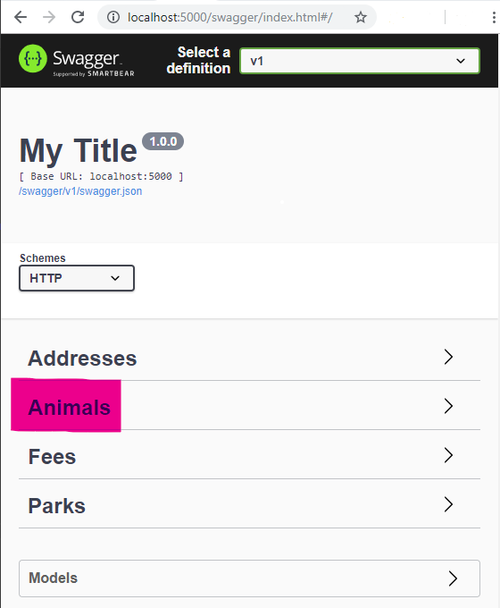
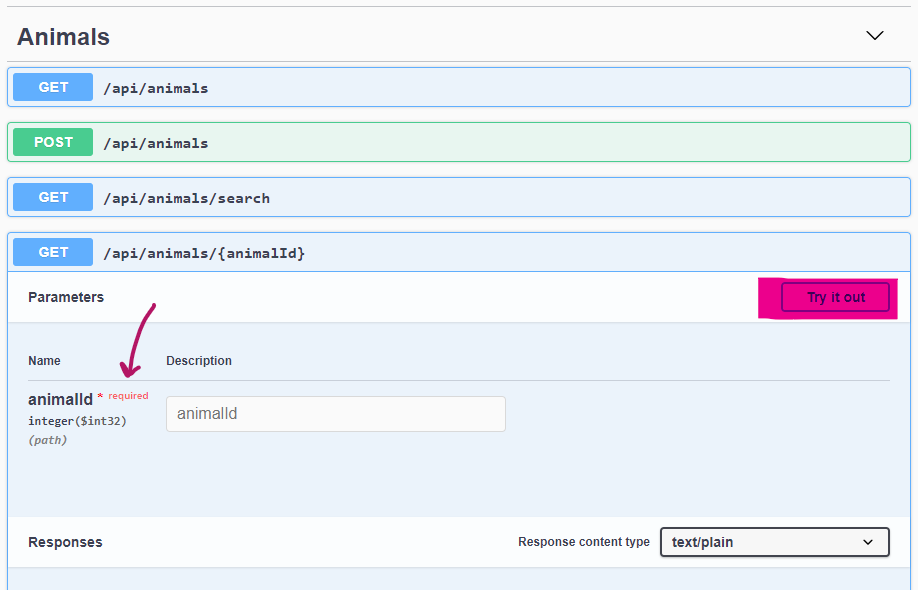
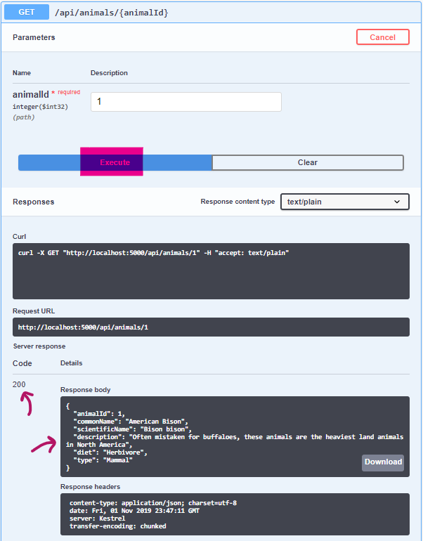

# Parks Api

#### An API for state and national parks, 01-Nov-2019

#### By **Christine Frank**

## Description

This is an API to provide information on state and national parks. It provides detailed informtion regarding the park. Information can be retrieved, added, updated or removed through the API interface.

## Setup/Installation Requirements

* Clone this repository to your desktop
* Install .NET Core SDK (if not already installed)
* Install REPL *dotnet script* (if not already installed)
    * Command: 'dotnet tool install -g dotnet-script'
* Install MySql Server and WorkBench (if not already installed)
* Open a new Command Terminal and start MySql Server if not already running
    * Command: mysql -uroot -p{EnterYourPassword}

* In the main project folder of the local repository, create a file "appsettings.json" and add the following content:

```JSON
{
  "ConnectionStrings":
  {
    "DefaultConnection": "Server=localhost;Port=3306;database=christine_frank;uid=root;pwd=epicodus;"
  }
}
```
* In a new Command Terminal route to the project folder of the local repository and run the restore command and then the migration command:
```
dotnet restore
...
dotnet ef database update
```
* Confirm successful migration
* Enter the run command into the open Command Terminal
```
dotnet run
```
* Open a new browser and enter 'http://localhost:5000/swagger/index.html'

## Useage Example
* Complete full setup/installation instructions
* In Swagger Home page, select a dropdown of choice (e.g. Animals)

* Click on bar with the action name you want to try out
* Click on the "Try it out!" button on the top right of the just-opened section

* Enter any required parameters and then click the blue "Execute" button just below the input(s) section
* Scroll down to the Response Body section for your results! 
  * Note the status code is displayed to the left of the Response Body section


## Known Bugs

None known at this time.

## Support and contact details

Find a bug?! Add an issue to the GitHub Repo.<br>
Repo: https://github.com/christinelfrank16/ParksApi.Solution

Other Contact<br>
Email: christine.braun13@gmail.com<br>
LinkedIn: https://www.linkedin.com/in/christine-frank/

## Application Specifications

* API includes functionaltiy to:
    * Create parks
    * Get parks
    * Update existing parks
    * Remove parks
* Additional API functionality includes:
    * Create, get and remove park addresses and fees
    * Create, get and remove animals
    * Add and remove animals to/from parks
    * Search parks by name, designation and/or state
    * Search park animals by common name, type (e.g. mammal), or diet
    * Search all animals by common name, type (e.g. mammal), or diet
* API hosts Swagger documentation

## Technologies Used

* .NET/C#
* Entity Framework

### License

*This application is licensed under the MIT license*

Copyright (c) 2019 **Christine Frank**